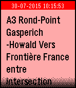

# PebbleTrafficLux
Traffic information for Luxembourg motorways on your wrist!

Data is fetched from http://cita.lu.

This app is unofficial and NOT in any way supported or endorsed by the Administration des ponts et chaussées, Luxembourg.

## Features

### Incidents

Displays a list of current traffic incidents. Select an entry to view its details in a scrollable card.

 

### Travel times

Displays a list of current travel times for a few destinations from several places.
Select a starting place in the list to view the complete card. 

 

### Webcams

Choose from a variety of traffic monitoring webcams to show on the Pebble screen.
Due to the limited resolution and color palette, image quality can suffer.
Best results achieved during daylight hours.

#### Webcam selection menus

A few "hotspots" (busiest junctions) are promoted to the top of the menu to quickly access webcams around these areas in a sub-menu.
Alternatively, the list is also sorted by motorway.

  

 
 
